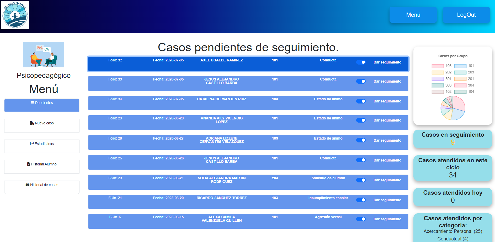
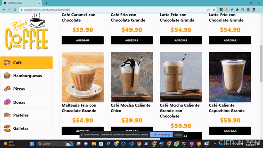
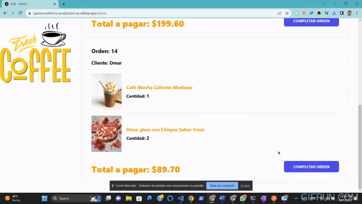
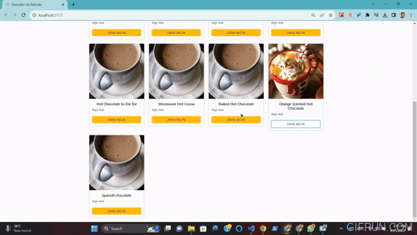
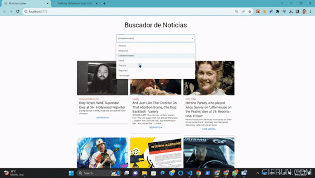

<h1 align="center">Hi 👋, I'm Omar Hernandez</h1>

- 🔭 I’m currently working on [CESISPE]([https://github.com/omarasael1980/busDolphins.git](http://cesispe.gob.mx/))

- 🌱 I’m currently working with **MERN**

- 👯 I'm currently practicing [MERN stack development and learning Django RestFramework] 

- 👨‍💻 All of my projects are available at [https://github.com/omarasael1980](https://github.com/omarasael1980)

- 📫 How to reach me **omarasael80@gmail.com**

- 📄 Know about my experiences [https://drive.google.com/drive/folders/1H6ZVA_oMTj_XzQigW3CnorrRK97oyUTF?usp=sharing](https://drive.google.com/drive/folders/1H6ZVA_oMTj_XzQigW3CnorrRK97oyUTF?usp=sharing)

- ⚡ Previous Background **Chemical Engineer**

### My Projects 🛠️

   

   <main align="left">
     
    
  </main>
  <aside>
    <h2  align="center">Sistema Integral Colegio Santee</h2>
    
 TThe developed system, utilizing PHP, MySQL, JavaScript, HTML, Bootstrap, CSS, and ChartJS, optimizes the control and management of services in the nursing and educational psychology departments. It generates printable reports, tracks school insurance expenses, and has significantly improved customer service, automating key processes and reducing response times since its implementation a few months ago.

  </aside>
  

  

  

   <main align="left">
     
    
  </main>
  <aside>
    <h2  align="center">Quiosco Coffee App</h2>
    
 This REACT app allows the customer to choose the food they want to buy, when sending their order, those in charge of preparing the food and delivering it can manage the orders., the   first image is the customer's view and the second belongs to the service and order delivery view.

  </aside>
  

   

   

   <main align="left">
     
    
  </main>
  <aside>
    <h2  align="center">Mixology Explorer: Discover and Create Cocktail Masterpieces</h2>
    
 Embracing the world of React, I've engineered a captivating app that taps into the art of mixology. This dynamic creation seamlessly integrates with an API, allowing users to explore a myriad of drink options based on their preferred alcohol type and beverage category. With the power to uncover and savor unique cocktail recipes, it's more than an app; it's a delightful journey into the world of mixological wonders

  </aside>
  

  

   

   <main align="left">
     
    
  </main>
  <aside>
    <h2  align="center">News App</h2>
    
Venturing into the dynamic world of React, I've crafted an exceptional app utilizing cutting-edge technologies such as Vite, harnessing the power of useContext and hooks. This application seamlessly interfaces with a news API, dynamically presenting captivating news articles tailored to the user's selected category. It's not just a project; it's a testament to my relentless pursuit of excellence in the realm of React development

  </aside>
  

  

  

<h3 align="left">Connect with me:</h3>

<h3 align="left">Languages and Tools:</h3>

                     

  

      
&nbsp;

          
  
&nbsp;

<h3>Other projects</h3> 

 
 
 

<h3 align="center">Building Bridges Between Concepts and Code.</h3>

  

